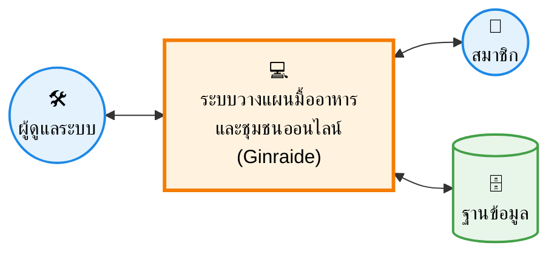

# แผนภาพบริบท (Context Diagram)

คุณสามารถแคปรูปด้านล่างนี้ ไปแปะลงในรายงานตรงหัวข้อ "3.3 การวิเคราะห์ระบบ" ได้เลยครับ รูปนี้จำลองโครงสร้างเดียวกับตัวอย่างที่คุณส่งมาเป๊ะเลยครับ

**คำอธิบายใต้ภาพ:**
> **ภาพที่ 3.1** แผนภาพบริบทระบบวางแผนมื้ออาหารตามงบประมาณพร้อมชุมชนออนไลน์สำหรับแลกเปลี่ยนเมนูอาหาร
