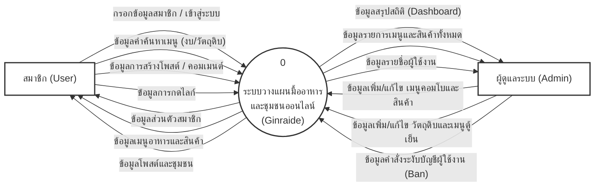

# 3.3.1 กระแสข้อมูล (Data Flow Diagram)

*(ก๊อปปี้ข้อความด้านล่างนี้ไปวางใน Word ได้เลยครับ)*

**3.3.1 กระแสข้อมูล (Data Flow Diagram)**

**3.3.1.1 วิเคราะห์การไหลของข้อมูล Context Diagram**
แผนภาพบริบท (Context Diagram) เป็นการออกแบบแผนภาพการไหลของข้อมูลระดับบนสุด ที่แสดงภาพรวมการทำงานที่มีความสัมพันธ์เกี่ยวข้องโดยตรงกับระบบของกลุ่มบุคคล ดังนี้
1) **ผู้ดูแลระบบ (Admin)** เป็นผู้จัดการข้อมูลเมนูอาหาร ข้อมูลสินค้า และจัดการผู้ใช้งาน
2) **ผู้ใช้งานทั่วไป (User)** เป็นผู้สมัครเข้ามาใช้งานระบบ เพื่อค้นหาเมนูอาหารและแลกเปลี่ยนข้อมูลในชุมชน

---

*(ด้านล่างนี้คือโค้ดสำหรับสร้างแผนภาพ DFD คุณสามารถแคปรูปจากหน้าต่างแสดงผลไปแปะใน Word ได้เลยครับ)*

**คำอธิบายใต้ภาพ:**
> **ภาพที่ 3.2** แผนภาพบริบท (Context Diagram) ระบบวางแผนมื้ออาหารและชุมชนออนไลน์ (Ginraide)
