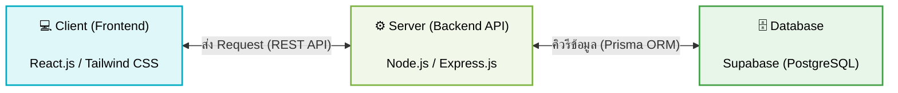

# แผนภาพสถาปัตยกรรมระบบ (System Architecture Diagram)

แผนภาพนี้แสดงโครงสร้างการทำงานแบบ Client-Server ของโปรเจ็กต์ Ginraide คุณสามารถแคปหน้าจอ (Screenshot) แผนภาพด้านล่างนี้ ไปแปะลงในไฟล์ Word บทที่ 3 ตรงหัวข้อ "การออกแบบสถาปัตยกรรม (Architecture Design)" ได้เลยครับ

**คำอธิบายเพิ่มเติมประกอบรูปภาพ (สามารถก๊อปไปใส่ใต้รูปใน Word ได้ครับ):**
> **ภาพที่ 3.X** แสดงการออกแบบสถาปัตยกรรมการทำงานของระบบ Ginraide 
> ระบบมีการทำงาน 3 ส่วนหลัก ได้แก่ 
> 1. **Client (Frontend)**: ส่วนติดต่อผู้ใช้งาน พัฒนาด้วย React.js ทำหน้าที่รับคำสั่งจากผู้ใช้และแสดงผลหน้าเว็บ
> 2. **Server (Backend API)**: ส่วนประมวลผล พัฒนาด้วย Node.js ทำหน้าที่รับ Request จาก Frontend มาประมวลผลตรรกะต่างๆ 
> 3. **Database**: ฐานข้อมูล Supabase (PostgreSQL) ทำหน้าที่จัดเก็บข้อมูลทั้งหมดของระบบ โดย Backend จะเชื่อมต่อและดึงข้อมูลผ่าน Prisma ORM
