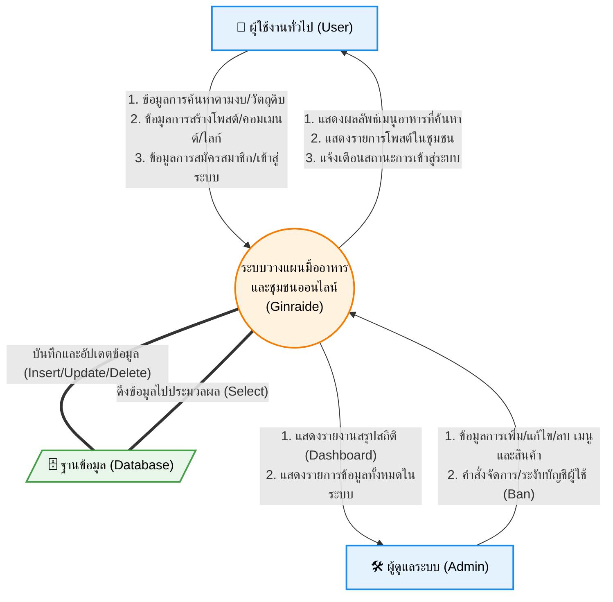

# Data Flow Diagram (DFD) ของระบบ Ginraide

ด้านล่างนี้คือแผนภาพ Data Flow Diagram (DFD Level 0) ซึ่งแสดงการไหลของข้อมูล (Data Flow) ระหว่าง "ผู้ใช้งานภายนอก (External Entities)" กับ "ระบบ (Process)" และ "ฐานข้อมูล (Data Store)" โดยแยกตามระดับผู้ใช้งาน คือ **ผู้ใช้งานทั่วไป (User)** และ **ผู้ดูแลระบบ (Admin)**

คุณสามารถใช้เครื่องมือ Snipping Tool (Windows + Shift + S) เพื่อแคปหน้าจอรูปนี้ไปแปะในรายงาน Word ของคุณได้เลยครับ

**คำอธิบายเพิ่มเติมใต้รูปภาพ (สำหรับก๊อปไปวางใน Word):**
> **ภาพที่ 3.X** แผนภาพกระแสข้อมูล (Data Flow Diagram - Context Diagram) ของระบบ Ginraide
> แสดงการไหลของข้อมูลระหว่างบุคคลภายนอก 2 ระดับ ได้แก่ **ผู้ใช้งานทั่วไป (User)** ที่ส่งข้อมูลการค้นหาเมนูและตั้งโพสต์เข้าสู่ระบบ และ **ผู้ดูแลระบบ (Admin)** ที่ส่งข้อมูลจัดการเมนูและจัดการผู้ใช้เข้าสู่ระบบ โดยระบบจะทำการบันทึกและดึงข้อมูลจากฐานข้อมูลเพื่อประมวลผลและส่งผลลัพธ์กลับไปยังผู้ใช้งานแต่ละระดับ
